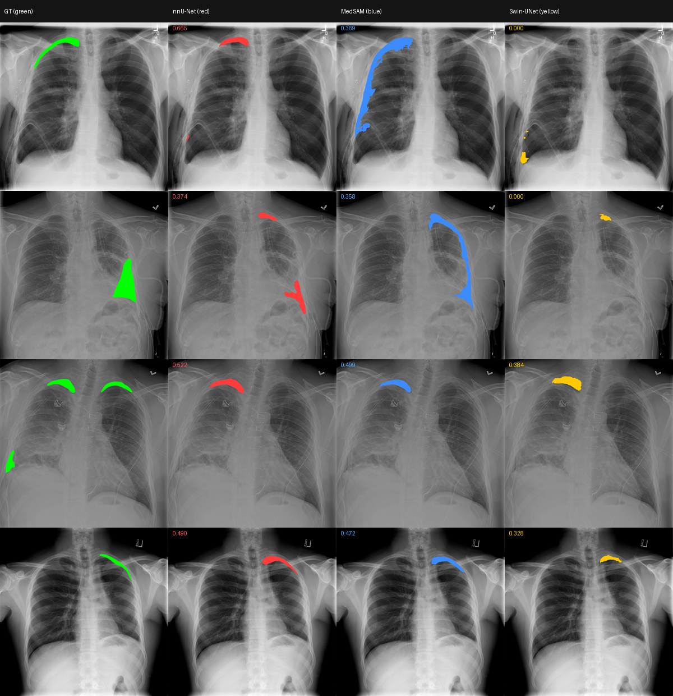

# pneumo-2d-eval

在 **SIIM-ACR Pneumothorax**（胸部 X 光氣胸分割）上比較三種不同架構的 2D 分割模型，驗證「輸入影像 → 輸出 mask」的完整路徑能跑通，作為後續醫療 Agent 的基礎建設。

| 模型 | 架構路線 | 取得方式 |
|---|---|---|
| **nnU-Net (2D)** | CNN 自動配置 | 從頭訓練（1000 epochs） |
| **Swin-UNet** | Transformer | 官方 repo + ImageNet 預訓練 encoder（150 epochs） |
| **MedSAM** | prompt-based foundation model | 官方 checkpoint，zero-shot，用 nnU-Net 預測框當 box prompt |

## 結果

Test 集 532 張，其中氣胸陽性 266 張。

| 模型 | Mean Dice（全部） | Mean Dice（陽性） |
|---|---|---|
| **nnU-Net (2D)** | 0.6315 | **0.5187** |
| **MedSAM**（借 nnU-Net 框） | **0.6324** | 0.5053 |
| **Swin-UNet** | 0.5995 | 0.3607 |

> Dice 在「預測空 ∩ GT 空」時計為 1.0，所以「全部」那欄會被陰性案例灌水。**真正該看的是陽性那欄。**



四欄由左至右：Ground Truth（綠）/ nnU-Net（紅）/ MedSAM（藍）/ Swin-UNet（黃），標註各案例 Dice。更多案例見 `outputs/verification/test_overlays_2~4.png`（共 16 例）。

## 觀察

- **nnU-Net 最穩定**，形狀最貼合 GT。用它的框餵 MedSAM 的設計因此成立。
- **MedSAM 是「框準就贏、框鬆就崩」**：框準時可反超 nnU-Net（0.960 vs 0.905）；框鬆時會**填滿整個框**而災難性過度分割（0.202 vs 0.756）。它的 mask 面積不能直接拿來跟另外兩者比。
- **Swin-UNet 最弱**（陽性 0.36），且失效模式是「完全不輸出」（Dice = 0.000）而非抓錯位置。原因是輸入解析度僅 224×224，對細長氣胸線條的細節保留不利（另兩者在 1024×1024 作業），且 transformer 需要更多資料。
- **三模型會「一起錯」**：有案例 GT 在右肺尖，三個模型全部預測到左側。這代表**模型間一致 ≠ 正確**，之後設計一致性檢查時不能只靠「不一致才警告」。
- 病灶夠大夠明顯時，三者都能到 0.8~0.96；失敗集中在小病灶、細微病灶、多病灶（只抓到其中一塊）。

## 設計

所有模型遵守同一個輸出約定：

> 對 `data/siim_acr/splits/test.txt` 裡的每個 case ID，輸出一張 `<case_id>.png`（1024×1024，前景非零）到 `outputs/<model>_preds/`

因此 `common/evaluate.py` 和 `common/make_overlays.py` 完全與模型無關，換個 `--preds-dir` 就能評估任一模型。MedSAM 自己沒有定位能力，其 box prompt 由 nnU-Net 的預測 mask 反推（`common/mask_to_bbox.py`）。

```
common/      rle_utils, dicom_to_png, dataset_split, mask_to_bbox,
             seg_dataset, metrics, evaluate, make_overlays
nnunet/      prepare_nnunet.py, env.sh
swin_unet/   make_npz.py, infer_swin.py
medsam/      infer_with_box.py
docs/        進度記錄.md（完整進度、踩坑記錄）
```

## 環境

RTX 5080（16GB，Blackwell / sm_120）、WSL2。三個獨立 conda 環境（皆 Python 3.10 + **PyTorch cu128**，Blackwell 需要此版本）：`nnunet-env`、`swinunet-env`、`medsam-env`。

> 用 conda-forge 建環境（Anaconda 預設頻道需接受 ToS）。每個環境裝完務必**實跑一次 GPU kernel** 確認 sm_120 可用，不能只看 `torch.cuda.is_available()`。

## 資料準備

⚠️ **Kaggle 競賽下載不含訓練影像** — 只有未標註的測試影像和 RLE 標註 CSV，訓練 DICOM 當年須從已停用的 GCP Healthcare API 抓。

因此影像取自 Kaggle 鏡像 `jesperdramsch/siim-acr-pneumothorax-segmentation-data`（原始 DICOM），標註用官方 `stage_2_train.csv`（SOP UID 對得上）。

```bash
python common/dicom_to_png.py --raw-dir data/raw/mirror/dicom-images-train \
  --rle-csv data/raw/stage_2_train.csv \
  --out-images data/siim_acr/images --out-masks data/siim_acr/masks
python common/dataset_split.py --masks-dir data/siim_acr/masks \
  --out-dir data/siim_acr/splits --neg-ratio 1.0
```

得到 train 4274 / val 532 / test 532（陽性陰性各半）。

> RLE 用的是**相對偏移**而非絕對 index（見官方 `mask_functions.py`）。`common/rle_utils.py` 已對照官方解碼器驗證一致。

## 重現

上游 repo 需自行 clone（未納入版控）：

```bash
git clone https://github.com/HuCaoFighting/Swin-Unet.git swin_unet/repo
git clone https://github.com/bowang-lab/MedSAM.git medsam/repo
# 另需下載 MedSAM checkpoint 與 Swin-Tiny ImageNet 預訓練權重
```

```bash
# nnU-Net（nnunet-env）
source nnunet/env.sh
python nnunet/prepare_nnunet.py --dataset-id 1
nnUNetv2_plan_and_preprocess -d 1 --verify_dataset_integrity -c 2d
nnUNetv2_train 1 2d 0
nnUNetv2_predict -i nnunet/nnUNet_raw/Dataset001_Pneumothorax/imagesTs \
  -o outputs/nnunet_preds -d 1 -c 2d -f 0 --disable_tta
python common/mask_to_bbox.py --masks-dir outputs/nnunet_preds \
  --out-json outputs/nnunet_preds/bboxes.json

# Swin-UNet（swinunet-env）
python swin_unet/make_npz.py --img-size 224 --dataset-name pneumo
cd swin_unet/repo && python train.py --dataset pneumo --n_class 2 --img_size 224 \
  --root_path ../npz_data --output_dir ../checkpoints \
  --cfg configs/swin_tiny_patch4_window7_224_lite.yaml \
  --max_epochs 150 --batch_size 24 && cd ../..
python swin_unet/infer_swin.py --checkpoint swin_unet/checkpoints/best_model.pth

# MedSAM（medsam-env，依賴 nnU-Net 的框）
python medsam/infer_with_box.py --bboxes outputs/nnunet_preds/bboxes.json \
  --checkpoint medsam/repo/work_dir/MedSAM/medsam_vit_b.pth

# 評估與疊圖
python common/evaluate.py --preds-dir outputs/nnunet_preds --name nnU-Net
python common/make_overlays.py --skip 0 --count 4
```

## 已知的坑

1. **RTX 5080 (sm_120)** — 必須 PyTorch cu128 build，且要實跑 kernel 驗證。
2. **torchvision 版本衝突** — nnunetv2 安裝時會從 PyPI 拉到非 cu128 的 torchvision，導致 `torchvision::nms does not exist`。需 `pip install --force-reinstall --no-deps torchvision --index-url https://download.pytorch.org/whl/cu128`。
3. **Kaggle 新版 token** — `KGAT_` 開頭的單一 token，舊版 `kaggle` CLI 只認 kaggle.json，改用 `kagglehub` + `~/.kaggle/access_token`。
4. **Swin npz 路徑** — 官方 `train.py` 只在 `--dataset Synapse` 時才把 `train_npz` 附加到 root_path，其他 dataset 名稱時 npz 需直接放 `--root_path` 下。

完整踩坑記錄見 [`docs/進度記錄.md`](docs/進度記錄.md)。
